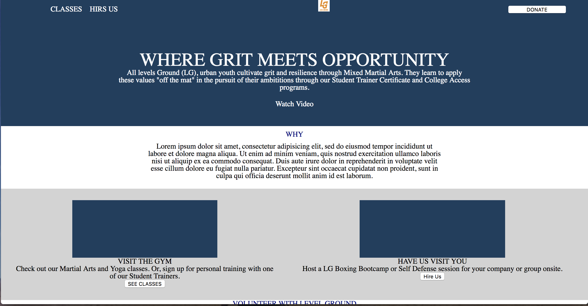

# LEVEL GROUND PROJECT
I built a simple client website

## How It's Made:
Used a html and css to display content and style a clean website. Used media queries to ensure responsiveness across three platforms.

**Tech used:** HTML, CSS

## Optimizations
I would add javascript to give the site behaviors and make it functional.

## Lessons Learned:

I learned how to build a website without using any templates and utilizing css to style the page.
